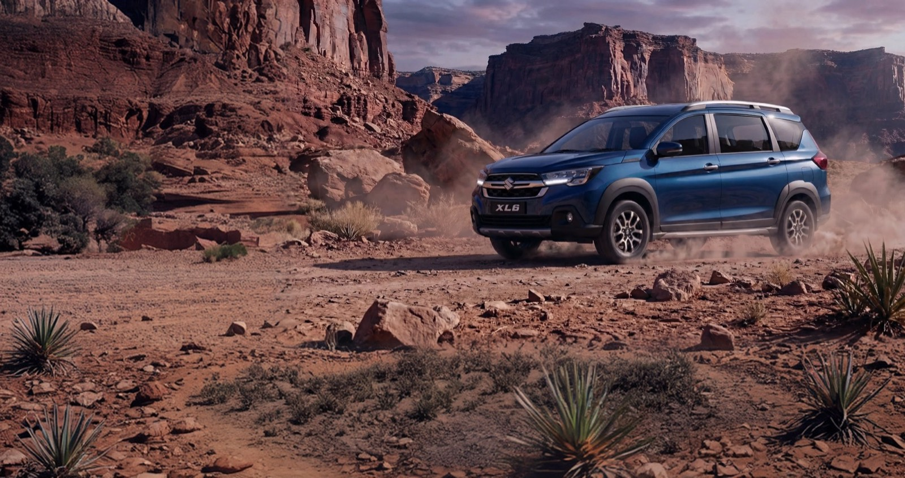
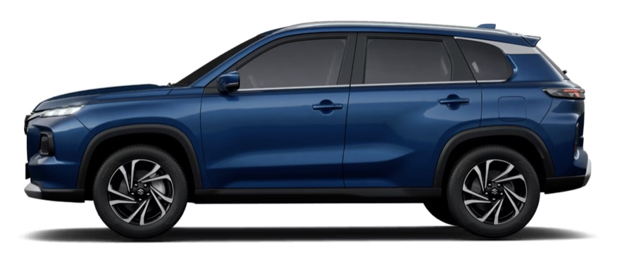

# MSIL Homepage

Migrated from Figma "Homepage proto" (node `493-43538`). The page is composed of
eight content-driven sections. Each block reads its content from the authored
table, so copy and images can be changed without touching code.

Local preview: `/drafts/homepage.html` (full DOM for every block).

---

## 1. Hero  — `hero` (variant `scroll-cue`)

Full-bleed background image with an overlaid heading, copy and two CTAs. Bold
link → filled indigo button; italic link → transparent button with a ↗.

| Hero (scroll-cue) |
| :---- |
|  |
| # The Next Chapter of mobility in India.   Built for how India drives, today and tomorrow.   **[See Our Range](/range)**   _[Download Brochure](/brochure)_ |

## 2. Our Range — `vehicle-cards`

Header row = eyebrow + heading (bold word is highlighted) in cell 1, brand
toggle list in cell 2. Each following row is a vehicle: image + name + copy +
a 3-item spec list (`Label — Value`).

| Vehicle Cards | |
| :---- | :---- |
| Our Range ## Discover Your **Next Drive** | - Arena - Nexa |
|  | ### Grand Vitara A bold, intelligent SUV… - Engine — 1299 cc - Power — 149 bhp - Mileage — 21.2 km/l |
| … one row per vehicle (Jimny, Baleno, Invicto) … | |

## 3. Technology — `tech-showcase`

Header row = eyebrow + a large lead paragraph (bold portion renders in ink, the
rest muted). Each following row is a feature slide (auto-numbered): image +
title + copy.

## 4. Discover the World — `explore-tabs`

Header row = heading + subtext. Each following row is a panel: image + title +
a list of items. Author the first item as `**Title** — description [Read more](/link)`
so it starts expanded; remaining items are just `**Title**`.

## 5. Concept statement — `statement`

Single cell: background image, a statement heading, and an optional foreground
image pinned right.

## 6. Keep Exploring — `explore-cards`

Header row = heading + subtext. Each following row is a card: image + title +
copy + a link (rendered as a corner arrow; the whole card is clickable).

## 7. Get Updates — `contact-tiles`

Header row = heading + subtext. Each following row is a tile: a label paragraph
and a value (bold text or a link). Icons are assigned by position
(phone, book, location, quote).

## 8. Footer — `site-footer`

Row 1 = five link columns (h4 + list). Row 2 = "Stay Connected" headline +
Subscribe button + two brand cards (image + title + subtitle). Row 3 = legal
disclaimers. Row 4 = company name + policy links.

---

### Design tokens

Added to `styles/styles.css` under *Design tokens from Figma — MSIL Corporate*:
`--msil-blue` `#171c8f`, `--msil-blue-bright` `#2b3ce6`, `--msil-navy` `#010a4b`,
`--msil-navy-2` `#0b1560`, `--msil-muted`, `--msil-faint`, `--msil-radius-card`
(20px), `--msil-radius-cta` (10px), `--msil-maxw` (1366px).
